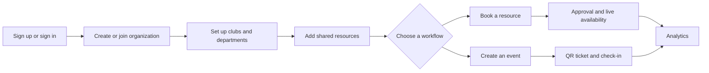
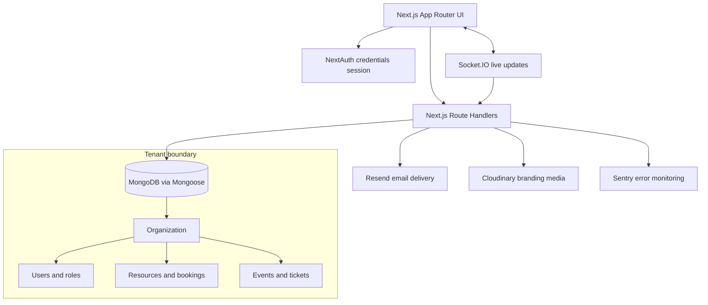
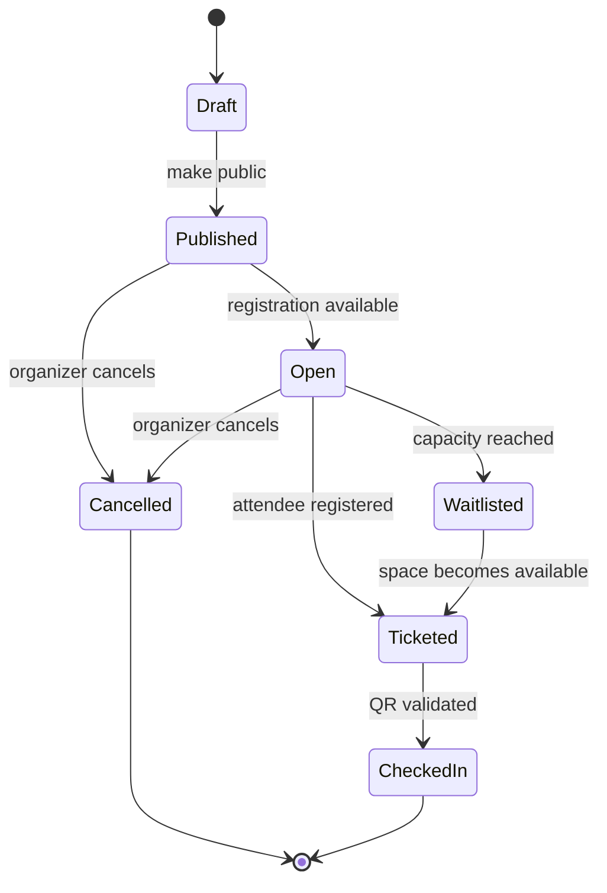

<div align="center">

# Blockspace

### A calm operating system for shared spaces

<a href="https://github.com/AaryanKumarSingh136/blockspace/actions"></a>
<a href="https://github.com/AaryanKumarSingh136/blockspace"></a>
<a href="LICENSE"></a>
<a href="https://nextjs.org/"></a>

<br />
<br />


<p>Resource booking, event ticketing, organization hierarchy, analytics, and live availability in one multi-tenant workspace.</p>

<p>
  <a href="https://github.com/AaryanKumarSingh136/blockspace/issues">Report a bug</a>
  ·
  <a href="https://github.com/AaryanKumarSingh136/blockspace/issues">Request a feature</a>
  ·
  <a href="CONTRIBUTING.md">Contribute</a>
</p>

</div>

## Why Blockspace

Shared spaces become difficult when calendars, people, permissions, events, and equipment live in different places. Blockspace gives organizations one reliable operating picture, with a deliberately quiet interface that makes repeated work easier to scan and act on.

## What It Does

| Area | Capability |
| --- | --- |
| **Workspace** | Dashboard with organization context, quick actions, and operational summaries |
| **Resources** | Book rooms, desks, equipment, and courts with conflict detection |
| **Live availability** | Real-time resource status and optimistic booking updates over Socket.IO |
| **Events** | Create events, manage capacity, issue QR tickets, scan entry, and handle waitlists |
| **Organization** | Departments, clubs, role-aware access, invitations, and custom branding |
| **Analytics** | Attendance, bookings, clubs, resource usage, and peak-hour reporting |
| **Trust** | NextAuth credentials sessions, bcrypt password hashing, rate-limited auth, Sentry monitoring, and tenant-scoped queries |
| **Themes** | Light, dark, and device themes with persistent preference |

## Product Flow



## Architecture



## Event Lifecycle



## Technology

- **Application:** Next.js 16, React 19, TypeScript, App Router
- **UI:** Tailwind CSS 4, shadcn/ui primitives, Radix UI, Lucide icons
- **Data:** MongoDB and Mongoose
- **Authentication:** NextAuth credentials provider with JWT sessions
- **Realtime:** Socket.IO with organization-scoped rooms
- **Messaging:** Resend transactional email
- **Media:** Cloudinary organization branding uploads
- **Observability:** Sentry
- **Runtime:** Node.js

## Run Locally

### Prerequisites

- Node.js 20 or newer
- npm
- A MongoDB database, local or Atlas

### Install

```bash
git clone https://github.com/AaryanKumarSingh136/blockspace.git
cd blockspace
npm install
```

Create a local environment file:

```bash
copy .env.example .env.local
```

On macOS/Linux, use `cp .env.example .env.local` instead. Set at least:

```env
MONGODB_URI=mongodb+srv://<user>:<password>@<cluster>/<database>
NEXTAUTH_URL=http://localhost:3000
NEXTAUTH_SECRET=<long-random-secret>
```

Generate a secret with:

```bash
node -e "console.log(require('crypto').randomBytes(32).toString('hex'))"
```

Start the development server:

```bash
npm run dev
```

Open [http://localhost:3000](http://localhost:3000).

### Useful Commands

| Command | Purpose |
| --- | --- |
| `npm run dev` | Start the custom Next.js + Socket.IO server |
| `npm run next-dev` | Start Next.js directly |
| `npm run build` | Create a production build |
| `npm run start` | Run the production server |
| `npm run lint` | Run ESLint |
| `npm run seed-admin` | Create a local super-admin account |

Create an admin with custom credentials:

```bash
npm run seed-admin admin@example.com "Use-a-long-password-here"
```

## Environment Variables

| Variable | Required | Purpose |
| --- | :---: | --- |
| `MONGODB_URI` | Yes | MongoDB connection string |
| `NEXTAUTH_URL` | Yes | Canonical application URL |
| `NEXTAUTH_SECRET` | Yes | Session signing and encryption secret |
| `RESEND_API_KEY` | No | Enables real email delivery; otherwise emails are simulated in logs |
| `SENTRY_DSN` | No | Production error monitoring |
| `CLOUDINARY_CLOUD_NAME` | No | Cloudinary organization logo uploads |
| `CLOUDINARY_API_KEY` | No | Cloudinary API access |
| `CLOUDINARY_API_SECRET` | No | Cloudinary API access |
| `NEXT_PUBLIC_SOCKET_URL` | No | Separate Socket.IO URL; defaults to the current origin |
| `ADMIN_EMAIL` | No | Default email for the seed script |
| `ADMIN_PASSWORD` | No | Default password for the seed script |
| `ADMIN_NAME` | No | Default name for the seed script |

Never commit `.env.local` or real credentials.

## Route Map

- `/` public product page
- `/sign-in`, `/sign-up`, `/forgot-password` authentication
- `/dashboard` organization overview
- `/availability` live resource status and quick booking
- `/bookings` reservation management
- `/events` event creation and ticketing
- `/events/[id]/scanner` QR check-in
- `/hierarchy` clubs, departments, and role structure
- `/analytics` usage and attendance reporting
- `/settings/branding` organization appearance
- `/admin` administrative controls
- `/org/[slug]` public organization page
- `/join` invitation redemption

API route groups live under `app/api`, including auth, bookings, events, organizations, public events, resources, and analytics.

## Security Notes

- Use a unique, high-entropy `NEXTAUTH_SECRET` in every environment.
- Password reset uses short-lived, single-use hashed tokens.
- Invitation redemption is bound to the invited email address.
- Public event cancellation requires the authenticated account.
- Socket connections are authenticated and restricted to the user’s organization room.
- Keep MongoDB network access restricted to trusted deployment sources.
- Treat QR tokens, environment variables, and invitation links as secrets.

See [SECURITY.md](SECURITY.md) for reporting vulnerabilities.

## Deployment

For Vercel deployment, follow [VERCEL_DEPLOYMENT.md](VERCEL_DEPLOYMENT.md). Before going live:

- Set production `NEXTAUTH_URL` and `NEXTAUTH_SECRET`.
- Configure MongoDB network access and backups.
- Configure Resend and verify delivery.
- Configure Sentry and test error reporting.
- Use a managed Socket.IO-compatible deployment if realtime is separated from the web process.
- Run `npm run build` against production configuration.

## Contributing

Read [CONTRIBUTING.md](CONTRIBUTING.md) before opening a pull request. Small, focused changes with clear validation are easiest to review.

## License

Blockspace is released under the [MIT License](LICENSE).

<div align="center">

<br />

*Make room for better work.*

</div>
